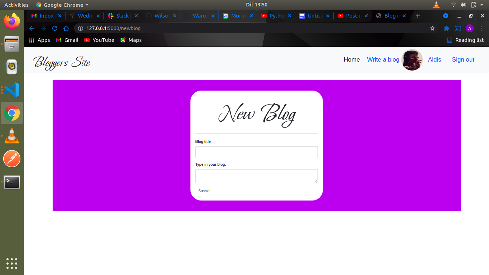

# BLOGGERS SITE
#### By: **Alfred Warui**
## Description of the application
The application enables users to view blogs and comment on them.For writers,they have to sign up first to be able to write and update blogs.Writers can also delete comments made on their blogs if they don't please them.
## Installation Requirements
* Clone this repository using the link from the clone button
* Open the downloaded folder in a text editor of your preference
* To install virtual environment
```
$ python3.8 -m venv --without-pip virtual
```
* Activate virtual environment
```
$ source virtual/bin/activate
```
* Install latest pip version inside virtual environment
```
$ curl https://bootstrap.pypa.io/get-pip.py | python
```
* Installing the dependencies
```
$ pip install -r requirements.txt
```
* Starting up the application
```
$ chmod a+x start.sh
```
```
$ ./start.sh
```
* Open port *http://127.0.0.1:5000/ * to interact with the application
  
## Known Bugs
There are known bugs.
## Technologies Used
* PYTHON
* FLASK
* HTML
* CSS
* BOOTSTRAP
* POSTGRESQL
* MARKDOWN for the *README.md* file
## Some screenshots





## My contacts
Feel free to contact me for assistance if need be or to offer suggestions for improvements.

- Email me:alfred.kahenya@student.moringaschool.com
- My phone number:0740365281
### License
* *License under [MIT License](LICENSE)*
* Copyright (c) 2021 **Alfred Warui**
